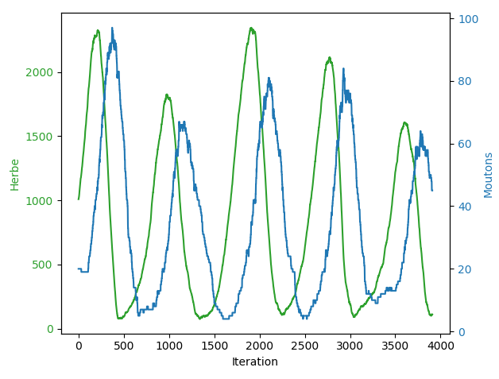

# Loup Et Mouton
Simulation d'une population de plante et de monton

## Comment l'ouvrir et le lancer :
-Télécharger Processing 3 : https://processing.org/download/

-Ouvrir et lancer "LoupEtMouton.pde" avec Processing 3

## Utilisation

Pour sauvegarder les données : garder appuyer la touche espace, puis cliquer
